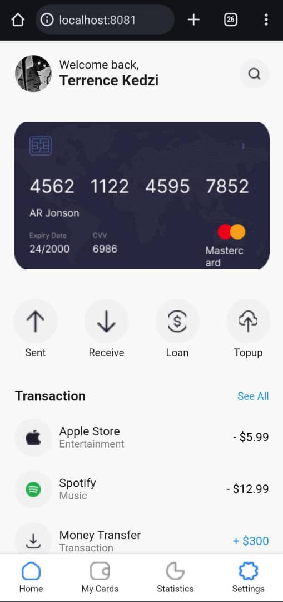
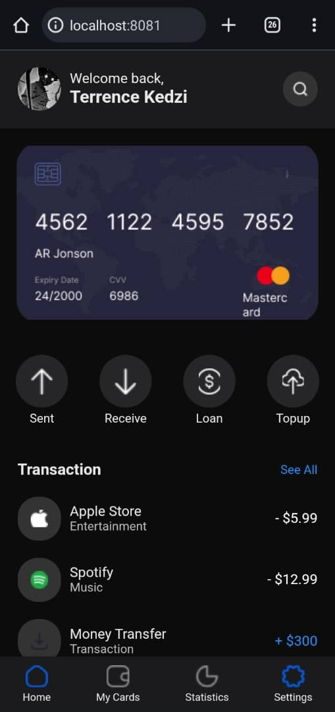
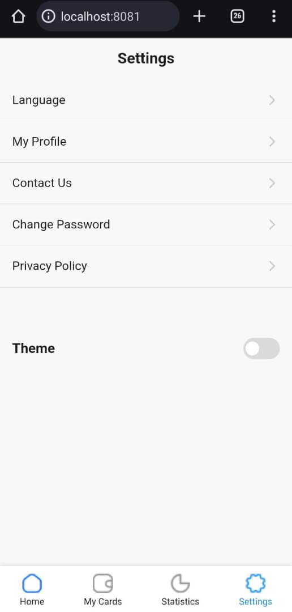
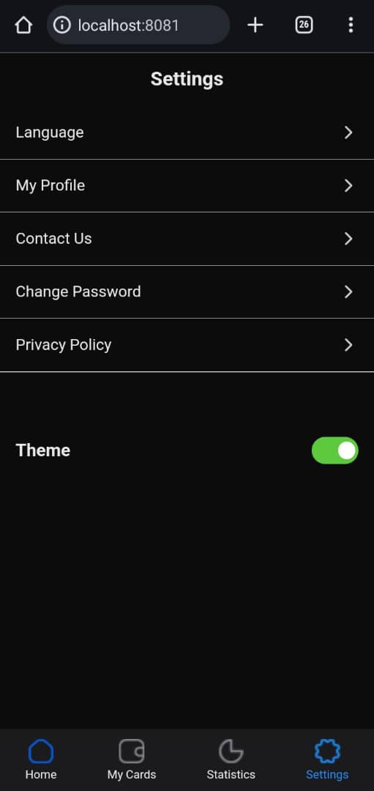

# rn-assignment5-11046896

## Description

This React Native application is designed to provide users with an intuitive interface to manage their finances. The app features a user-friendly dashboard displaying a summary of transactions, quick access buttons for common actions, and a bottom navigation bar for easy navigation.

### Key Features:
- Welcome screen with user profile and search functionality.
- A card image displaying account information.
- Action buttons for common tasks like sending money, receiving money, taking loans, and topping up.
- A transaction list displaying recent transactions with icons, categories, and amounts.
- A bottom navigation bar for quick access to Home, My Cards, Statistics, and Settings.

## How I Built This Application

### Technologies Used
- **React Native**: For building the mobile app.
- **Styled-components**: For styling React components.
- **JavaScript**: For writing the application logic.

### Steps Taken

1. **Setting Up the Project**: Initialized a new React Native project and installed necessary dependencies, including `styled-components`.
2. **Creating Components**: Built various components like `Header`, `ButtonsSection`, `TransactionsSection`, and `NavBar` to structure the app.
3. **Styling Components**: Used `styled-components` to create reusable styles for components.
4. **Adding Functionality**: Implemented functionality for displaying user information, transaction details, and navigation.
5. **Integrating Images**: Added images for profile picture, search icon, card, transaction icons, and action buttons.
6. **Testing and Debugging**: Tested the application on different devices to ensure responsiveness and fixed any issues.


## Installation and Running

1. **Clone the Repository**:
   ```sh
   git clone https://github.com/Eqnerret/rn-assignment5-11046896
   cd myrnapp

2. **npm install**

3. **Run**
npx react-native run-android   # For Android


## Screenshots

### Home Screen(light mode)


### Home Screen(dark mode)


### Settings Screen(light mode)


### Settings Screen(dark mode)
